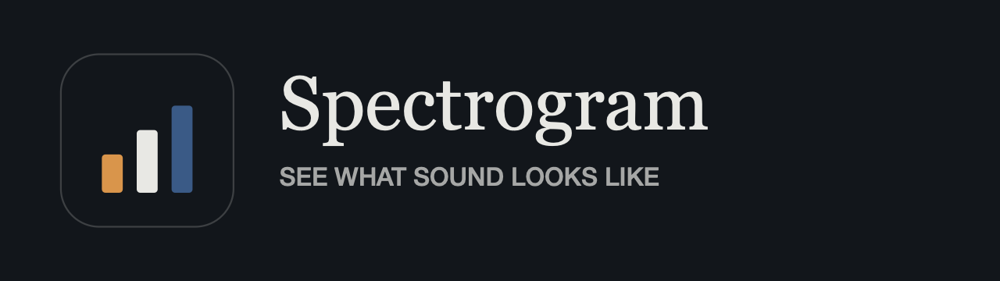
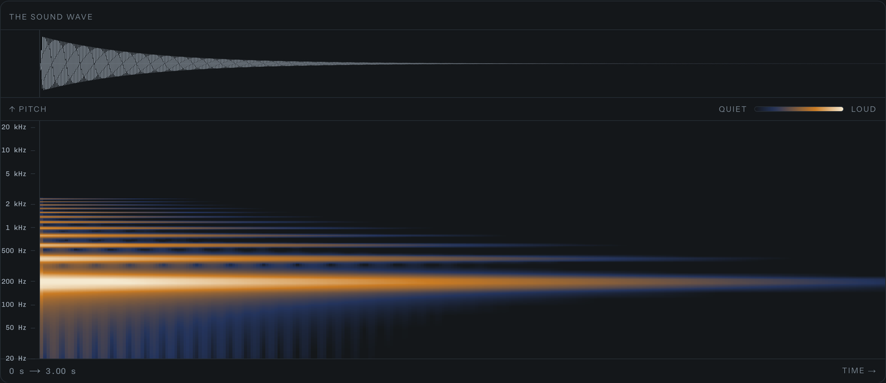
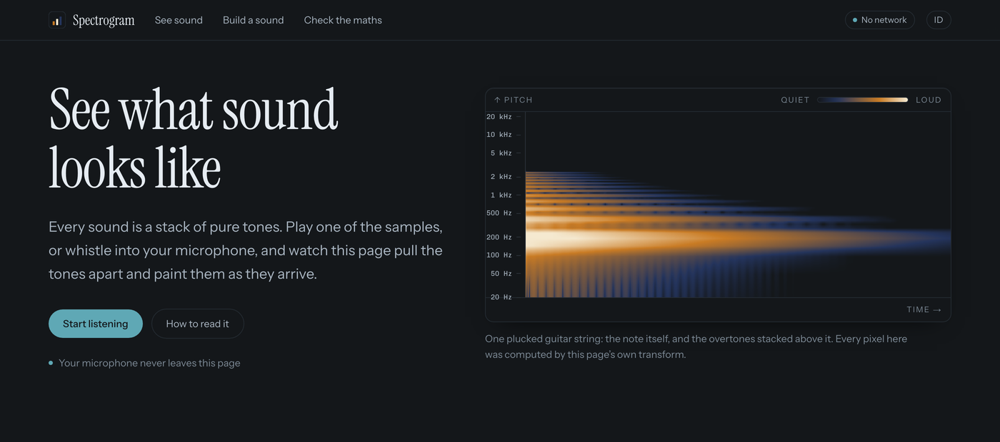
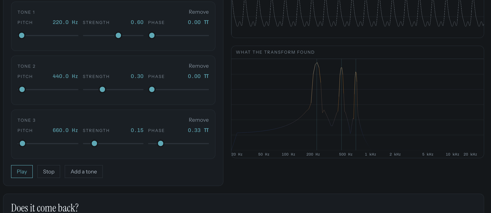

<div align="center">



**Sound, decomposed into its frequencies — with the Fourier transform written from scratch, and the time-frequency tradeoff made into a control you can drag.**

[**Open the live site →**](https://andifathulms.github.io/spectrogram/)

[](https://github.com/andifathulms/spectrogram/actions/workflows/deploy.yml)


</div>



A static site. No backend, no accounts, and no network requests at runtime.

## What this is

The browser will draw you a spectrogram in ten lines. `AnalyserNode.getByteFrequencyData()` exists, and a spectrogram built on it demonstrates nothing beyond knowing the API.

So the project is the transform itself: a radix-2 Cooley-Tukey FFT written by hand — bit-reversal permutation, butterflies over precomputed twiddle factors, in place, on separate real and imaginary `Float64Array`s — running at audio rates in a browser tab.

**A wrong FFT still draws a beautiful picture.** That is the failure mode this project is built against, so the transform has four independent correctness signals, all of which existed before any interface did:

| Signal | What it catches |
|---|---|
| Naive DFT oracle | Anything. It is the literal definition, checked across every supported size and a seeded corpus. |
| Parseval's identity | Scaling and indexing errors. Asserted on *every* input in *every* suite, not just its own. |
| Round trip | Inverse-transform errors, and normalisation put on the wrong side of the pair. |
| Analytic fixtures | DC, bin-centred sine, unit impulse, and the exact Dirichlet kernel at a half-bin offset — each checkable by hand, none dependent on another implementation. |

256 tests. `pnpm test:dsp` runs the four above; `pnpm bench:fft` asserts throughput *and* flat heap growth over a minute of sustained analysis.

At the reference load — 2048 points, 75% overlap, 48 kHz, on this desktop — that is **0.105 ms per column, 101× real time, and 0.6 bytes of heap growth per column** over a minute of sustained analysis.

## The idea it teaches

You cannot have sharp time resolution and sharp frequency resolution at once. To measure a low frequency you must observe several of its cycles, so the window must be long — but everything inside it collapses into one column. Shorten the window for sharper timing and bin spacing widens, because bin spacing is sample rate divided by window length.

This is the same mathematics as the Heisenberg uncertainty principle, not an engineering limitation waiting for a better algorithm. Dragging the detail control makes it land in about four seconds.

## Pages

| Path | |
|---|---|
| `/[locale]/` | The explanation. A live spectrogram of a bundled sample, then how to read its three axes. |
| `/[locale]/listen` | The plate. Spectrogram, waveform with the analysis-window bracket, hover readout, and the tradeoff as three named positions over the window-size slider. |
| `/[locale]/build` | Stack pure tones and watch the spectrum recover exactly what you put in, with the round-trip residual on screen. |
| `/[locale]/proof` | Our FFT against `AnalyserNode`, same input, per-bin difference and timings for both. |





English is the default locale; Bahasa Indonesia is at `/id`, complete. Slugs are locale-independent. Signal-processing terms stay in English in both.

The interface leads with the plain word and keeps the technical one behind it — "Detail" on the page, "window size" in the advanced panel — so the vocabulary is never the thing standing between a visitor and the idea. Every word the interface says lives in `lib/i18n`; `lib/dsp` and `data/samples` hold no copy at all, and a test asserts both dictionaries carry the same keys.

## Privacy

Microphone audio never leaves the device. There are no network requests of any kind after load — no analytics, no telemetry, no error reporting, no font CDN, no remote samples.

This is structural, not a promise, and it is verified twice:

- `tests/privacy/no-network.test.ts` fails if `fetch`, `XMLHttpRequest`, `sendBeacon`, `WebSocket`, `EventSource`, `MediaRecorder`, `RTCPeerConnection` or an absolute URL appears anywhere in shipped code. It also pins which files may call `postMessage`.
- `scripts/finalize-export.mjs` runs on every build and fails it if the export contains a reference the browser would resolve to another host.

The bundled samples are generated by code rather than downloaded, which is also why `data/samples/LICENSES.md` has nothing third-party in it.

The one place another host is named is the maker's mark in the footer — four links to the author's profiles, pinned by URL in both guards. A link is not a request: nothing is fetched from them, the icons beside them are inline SVG, and the browser resolves the addresses only when a visitor clicks and leaves. Everything a browser resolves on its own — `src`, `<link href>`, `url()`, `@import` — still fails the build on any host.

## Running it

```bash
pnpm install
pnpm dev

pnpm test:run     # the full suite
pnpm test:dsp     # DFT oracle, Parseval, round trip, analytic fixtures
pnpm bench:fft    # throughput and heap growth
pnpm typecheck
pnpm lint

pnpm build        # static export to ./out, plus the export verification
pnpm preview      # serves ./out under the production basePath
```

`basePath` must match the repository name. It defaults to `/spectrogram` and is overridden by `NEXT_PUBLIC_BASE_PATH`, which the deploy workflow sets from the Pages configuration.

## Architecture

```
samples (Float32Array)
  → window function      → windowed frame
  → fft (ours)           → complex bins
  → magnitude + dB       → column
  → ring buffer          → plate bitmap
```

- **`lib/dsp` is pure and environment-free.** Typed arrays in, typed arrays out. No Web Audio, no DOM, no React, no clock. That is what makes it testable in Node, which is what makes the correctness claims mean anything.
- **No allocation in the hot loop.** Twiddle tables, bit-reversal tables, window coefficients and output buffers are precomputed or reused. Column buffers are even recycled back across the worker boundary.
- **Analysis is off the main thread.** It runs in a Worker, not in the AudioWorklet — an AudioWorklet module cannot reliably use ES imports, and putting the FFT there would mean a second, inlined copy of `lib/dsp` that the correctness suites do not cover. `public/worklets/tap.worklet.js` is a pure capture tap that computes nothing.
- **The plate is a ring buffer blitted as `ImageData`**, never a redraw of the history.
- **`AnalyserNode` appears only in the comparison view**, labelled as the reference implementation. A test enforces that.
- **One palette, written twice.** The instrument's seven colours and the chrome tokens live in `tailwind.config.ts`; canvas code, which cannot read a class, takes the same values from `lib/ui/colors`, and a test fails if the two drift apart.

Next.js 14 (App Router, `output: 'export'`), TypeScript in `strict` mode, Tailwind, Vitest. Three runtime dependencies — `next`, `react`, `react-dom` — and a test asserts no fourth arrives.

## Brand

The mark is **Batang**: three bars rising quiet → loud, which is the picture the app draws. Its colours are the spectrogram's own brightness scale — Loud `#D9954B`, Paper `#E8E8E4`, Quiet `#3A5A86` — and teal `#6FB9B4` is reserved for the single primary action.

The full kit (vector masters, icon sizes, lockups, wordmarks, social card) lives in `exports/`, which is not committed; only the sizes the app serves are, under `public/` and `docs/brand/`.

## Honest notes

- The comparison view is honest that `AnalyserNode` is faster, because it is native. The claim being made here is correctness, not speed.
- The benchmark figures above were measured on desktop. The mid-range-phone measurement has not been done yet, and no release has been exercised on a real iOS device.
- No `AnalyserNode` cross-check runs in CI — the comparison is a browser-only interaction today, not an automated test.
- There is no service worker, so the manifest declares `display: browser`. An installed standalone shell would fail the moment it opened offline.

## Sources

Cooley, J. W. & Tukey, J. W. (1965). *An Algorithm for the Machine Calculation of Complex Fourier Series.* Mathematics of Computation 19, 297–301.

Harris, F. J. (1978). *On the Use of Windows for Harmonic Analysis with the Discrete Fourier Transform.* Proceedings of the IEEE 66(1), 51–83. — Table I is the source for every window coefficient, coherent gain, ENBW and sidelobe figure asserted in the tests.

---

<div align="center">

Designed & built by [Andi Fathul Mukminin](https://andifathulms.github.io/en/)
· [GitHub](https://github.com/andifathulms)
· [LinkedIn](https://www.linkedin.com/in/andifathulmukminin/)
· [Instagram](https://www.instagram.com/andifathulms/)

</div>
